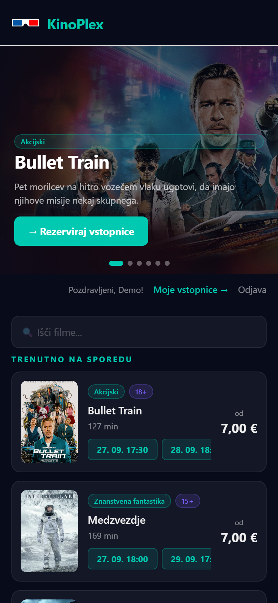
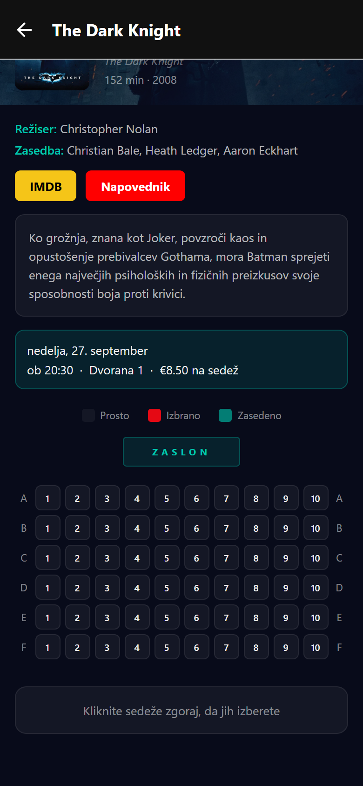

# KinoPlex Mobile

[](https://github.com/Horvatium/cinema-mobile/actions/workflows/ci.yml)

React Native (Expo) app for **KinoPlex**, a cinema ticket booking system. Customers browse the
programme, pick seats and book tickets from their phone, and get notified about their bookings.
It uses the same API as the web app. Built as part of my bachelor's thesis.

**API:** [cinema-api](https://github.com/Horvatium/cinema-api) ·
**Web app:** [cinema-web](https://github.com/Horvatium/cinema-web) ([kinoplex.si](https://www.kinoplex.si)) ·
[Slovenska različica](README.sl.md)

| Login                                       | Programme                               | Seat selection                          |
| ------------------------------------------- | --------------------------------------- | --------------------------------------- |
|  |  |  |

## Features

- Login and registration with email verification. The session is kept in AsyncStorage and ends
  automatically when the JWT expires.
- Programme with a featured-film carousel and search
- Film details with an IMDb link and trailer
- Seat map that scales to the screen width
- Booking without in-app payment; online payment is available on the web app
- "My tickets": view and cancel your own bookings
- Notifications: local notifications when a booking is confirmed or cancelled, and push
  notifications from the API (via Expo Push) when the cinema cancels a screening

## Tech stack

| Area          | Technology                                               |
| ------------- | -------------------------------------------------------- |
| Framework     | React Native 0.81, Expo SDK 54                           |
| Navigation    | React Navigation (native stack)                          |
| API client    | Axios with a JWT interceptor and logout on expired token |
| Storage       | AsyncStorage                                             |
| Notifications | expo-notifications, Expo Push                            |
| Delivery      | EAS Build, EAS Update                                    |
| Tooling       | ESLint (eslint-config-expo), Prettier, GitHub Actions    |

## Getting started

Requires Node.js 22 and the [Expo Go](https://expo.dev/go) app on your phone, or an Android
emulator.

```bash
git clone https://github.com/Horvatium/cinema-mobile.git
cd cinema-mobile
npm install
npx expo start
```

Scan the QR code with Expo Go. By default the app talks to the production API. To use a local
API, for example the Docker setup from [cinema-api](https://github.com/Horvatium/cinema-api),
copy `.env.example` to `.env` and set `EXPO_PUBLIC_API_URL`. On a physical phone, use your
computer's LAN IP address, not `localhost`.

```bash
EXPO_PUBLIC_API_URL=http://192.168.0.17:5000/api
```

With a local API from the seed data, you can log in as `demo@kinoplex.test` / `Demo123!`.
This account exists only in the local seed database.

### Building an APK

With [EAS Build](https://docs.expo.dev/build/introduction/):

```bash
npx eas build --platform android --profile preview
```

Or locally, with the Android SDK installed, run `build.bat` on Windows. It runs
`expo prebuild` and then `gradlew assembleRelease`.

## CI

Every push and pull request runs [the CI workflow](.github/workflows/ci.yml): ESLint, a
Prettier check and an Expo export of the Android JavaScript bundle. The export catches broken
imports and syntax errors without a full native build.

## Author

**Vid Gudič** · bachelor's thesis, CPU, 2026
